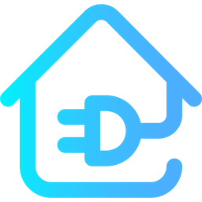

# Demand Control
[![GitHub Release][releases-shield]][releases]
[![License][license-shield]][license]
[![hacs_badge][hacsbadge]][hacs]
[![hainstall][hainstallbadge]][hainstall]



[](https://my.home-assistant.io/redirect/hacs_repository/?owner=domoriks&repository=demand_control&category=integration)
[](https://my.home-assistant.io/redirect/config_flow_start/?domain=demand_control)

Home Assistant custom integration for dynamic EV charging control based on your electricity meter power and monthly demand budget. In Belgium, grid tariffs include a **capacity tariff** based on your **monthly peak demand** — the highest 15-minute average power (kW) recorded during the calendar month. Keeping this peak low directly reduces your electricity bill. This integration dynamically throttles EV charging in real time to prevent new demand peaks, using live data from your smart meter.

## Disclaimer

Built and maintained by a single developer for a personal setup. Use at your own risk — the developer is not responsible for any damage, charging issues, or data loss.

## Features

- UI-based setup via entity selectors — no YAML required.
- Real-time EV charging control based on live electricity meter power.
- Optional 15-minute demand guard using average demand sensors.
- Two EV actuator modes: **Current** (`A`) or **Power** (`kW`) via a `number` entity.
- Current Projected Demand tracking to anticipate end-of-interval peaks.
- Resume lockout logic to prevent rapid charge resumption while demand remains high.
- 11 diagnostic/runtime sensors and 3 configurable `number` entities.

## Installation

### HACS (recommended)

1. Open HACS in Home Assistant.
2. Add this repository as a custom repository if not already listed:
   - URL: `https://github.com/domoriks/demand_control`
   - Category: `Integration`
3. Install **Demand Control** and restart Home Assistant.

### Manual

1. Copy `custom_components/demand_control` into your `custom_components` folder.
2. Restart Home Assistant.

## Configuration

Sensor inputs are read from your smart meter. The [DSMR integration](https://www.home-assistant.io/integrations/dsmr) is the recommended source for all three sensor inputs.

1. Go to **Settings → Devices & Services → Add Integration** and search for **Demand Control**.
2. Select **Electricity Meter Power** — total power usage reported by your smart meter.
3. Select **EV actuator mode** (`Current` or `Power`) and the corresponding `number` entity for your charger.
4. Optionally (but recommended for full demand control):
   - **Current average demand sensor** — the running 15-minute average demand from your meter.
   - **Maximum demand this month sensor** — the highest demand peak recorded so far this month.
5. Configure limits: max home demand (kW), phase count, line voltage, min/max charge current or power, step sizes, and scan interval.

> Without the demand sensors, the integration falls back to instant-power limiting only.

## Entities

Platform | Description
-- | --
`sensor` | Status, electricity meter power, current average demand, maximum demand this month, Current Projected Demand, target current/power limits, resume lockout state/timestamp, EV actuator mode/entity
`number` | Max home demand (kW), max charge current (A), max charge power (kW)

## Blueprints

### Reset max home demand monthly

Resets the **Max home demand** number at the start of each month so the budget resets with the billing period.

[](https://my.home-assistant.io/redirect/blueprint_import/?blueprint_url=https://github.com/domoriks/demand_control/blob/main/blueprints/automation/demand_control/reset_max_home_demand_monthly.yaml)

### Sync max home demand daily from monthly peak

Automatically lowers the **Max home demand** number each day to match the highest recorded peak this month, tightening the budget as the month progresses.

[](https://my.home-assistant.io/redirect/blueprint_import/?blueprint_url=https://github.com/domoriks/demand_control/blob/main/blueprints/automation/demand_control/sync_max_home_demand_daily_from_month_max.yaml)

## Troubleshooting

| Status | Cause |
|---|---|
| `missing_current_actuator` | Current mode selected but no EV current actuator entity set. |
| `missing_power_actuator` | Power mode selected but no EV power actuator entity set. |
| `home_power_unavailable` | Electricity Meter Power entity has no valid numeric state. |
| `current_average_demand_unavailable` | Demand sensor configured but currently unavailable. |

Enable debug logging in `configuration.yaml`:

```yaml
logger:
  default: info
  logs:
    custom_components.demand_control: debug
```

## License

MIT License — see `LICENSE` for full text.

[releases-shield]: https://img.shields.io/github/release/domoriks/demand_control.svg
[releases]: https://github.com/domoriks/demand_control/releases
[hacsbadge]: https://img.shields.io/badge/HACS-Custom-orange.svg
[hacs]: https://github.com/hacs/integration
[hainstallbadge]: https://img.shields.io/badge/dynamic/json?color=41BDF5&logo=home-assistant&label=installs&suffix=%20users&cacheSeconds=15600&url=https://analytics.home-assistant.io/custom_integrations.json&query=$.demand_control.total
[hainstall]: https://analytics.home-assistant.io/custom_integrations
[license-shield]: https://img.shields.io/github/license/domoriks/demand_control.svg
[license]: https://github.com/domoriks/demand_control/blob/main/LICENSE
